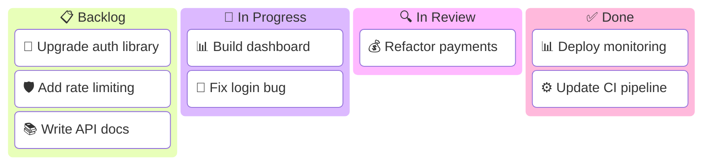
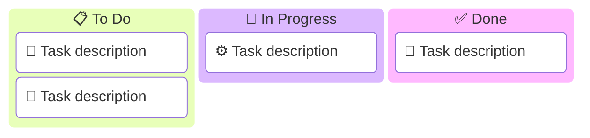
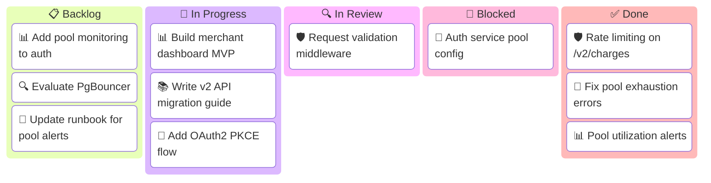

# Kanban Board

> **Back to [Style Guide](../mermaid_style_guide.md)** — Read the style guide first for emoji, color, and accessibility rules.

**Syntax keyword:** `kanban`
**Best for:** Task status boards, workflow columns, work-in-progress visualization, sprint status
**When NOT to use:** Task timelines/dependencies (use [Gantt](gantt.md)), process logic (use [Flowchart](flowchart.md))

> ⚠️ **Accessibility:** Kanban boards do **not** support `accTitle`/`accDescr`. Always place a descriptive _italic_ Markdown paragraph directly above the code block.

---

## Exemplar Diagram

_Kanban board showing the current sprint's work items distributed across four workflow columns, with emoji indicating column status:_

---

## Tips

- Name columns with **status emoji** for instant visual scanning
- Add **domain emoji** to tasks for quick categorization
- Keep to **3–5 columns**
- Limit to **3–4 items per column** (representative, not exhaustive)
- Items are simple text descriptions — keep concise
- Good for sprint snapshots in documentation
- **Always** pair with a Markdown text description above for screen readers

---

## Template

_Description of the workflow columns and what the board represents:_

---

## Complex Example

_Sprint W07 board for the Payments Team showing a realistic distribution of work items across five columns, including blocked items:_

**Tips for complex kanban diagrams:**

- Add a **Blocked** column to surface stalled work — this is the highest-signal column on any board
- Keep items to **3–4 per column max** even in complex boards — the diagram is a summary, not an exhaustive list
- Use the **same emoji per domain** across columns for visual tracking (📊 = dashboards, 🛡️ = security, 🐛 = bugs)
