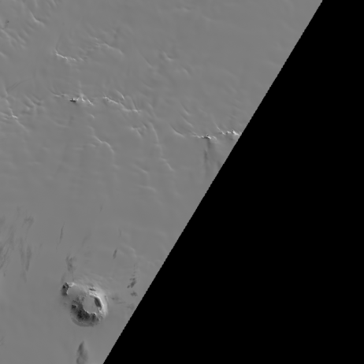
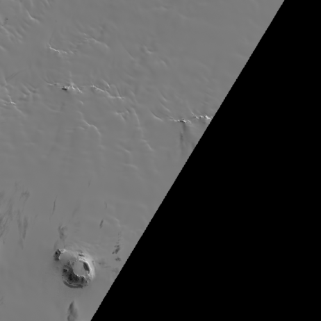

# NDVI Workflow Walkthrough

This document demonstrates a simple workflow for downloading Sentinel-2 satellite imagery over a farm field near zip code 94514 (Discovery Bay / Mountain House, California), extracting the red and near-infrared (NIR) bands, and computing a Normalized Difference Vegetation Index (NDVI) image. All inputs, scripts, and outputs reside in the `data/` directory.

## 1. Download raw imagery

We used the public AWS Sentinel‑2 L1C bucket to fetch band files for tile **10/C/DA** acquired on 2016‑11‑30. The two bands of interest are:

- **B04 (Red)** – 665 nm wavelength
- **B08 (NIR)** – 842 nm wavelength

The Python script `data/ndvi_workflow.py` handles the download. After running it the `data/` folder contains `B04.jp2` and `B08.jp2` plus converted GeoTIFF versions.

## 2. Extract single-band images

Using `rasterio`, the JP2 files were converted to GeoTIFFs (`B04.tif` and `B08.tif`). These are the "inputs" for the remainder of the workflow.

### Red band



The file `red_band.png` is a downsampled preview of the red channel.

### NIR band



Similarly, `nir_band.png` shows the near-infrared channel.

## 3. Calculate NDVI

NDVI is computed as

\[\mathrm{NDVI} = \frac{\mathrm{NIR} - \mathrm{Red}}{\mathrm{NIR} + \mathrm{Red}}\]

The script `data/ndvi_postprocess.py` performs the calculation on a reduced-resolution grid for speed, writes out `ndvi.tif`, and also produces a preview PNG.


The resulting image highlights vegetation health: greener areas have higher NDVI values, while brown/gray zones correspond to bare soil or non‑vegetated surfaces.

## 4. Files and scripts

All relevant materials are stored under `data/`:

```
B04.jp2          # raw red JP2 downloaded from AWS
B08.jp2          # raw NIR JP2 downloaded from AWS
B04.tif          # converted GeoTIFF red band
B08.tif          # converted GeoTIFF NIR band
red_band.png     # preview of red band
nir_band.png     # preview of NIR band
ndvi.tif         # computed NDVI (downsampled)
ndvi.png         # preview NDVI image
ndvi_workflow.py # download and conversion script
ndvi_postprocess.py # PNG generation and NDVI calculation
ndvi_walkthrough.md # this document
```

Feel free to rerun the Python scripts or adapt the bounding box / tile to other dates and regions. The patterns shown here can be reused with Landsat imagery as well by simply changing the download URLs and band indices.