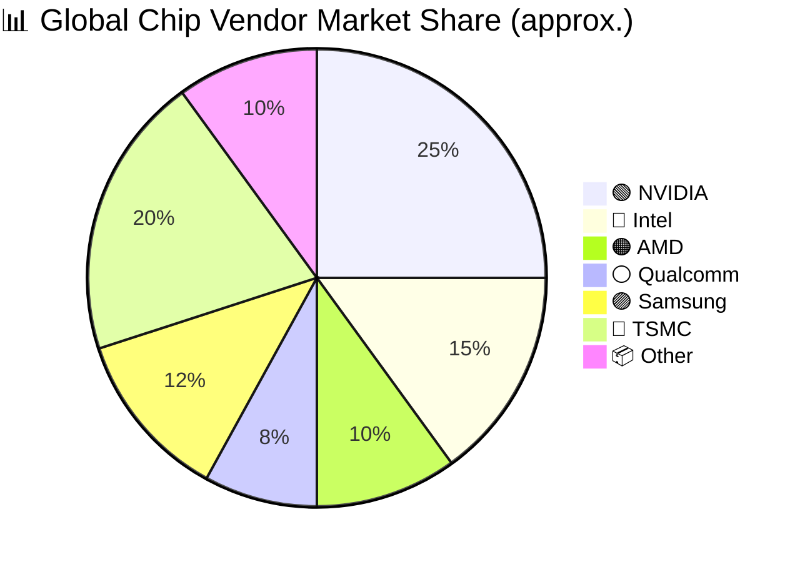

# Chip Company Market Share Example

This document contains a complex Mermaid example showing the relative market share of major semiconductor companies. It is intended as a teaching example for the repository's Mermaid style conventions.

> 🔧 *Tip:* values in a pie chart do not need to sum to 100; they are treated proportionally.

This example uses an emoji prefix, includes `accTitle`/`accDescr` for accessibility, and orders slices roughly largest to smallest.
