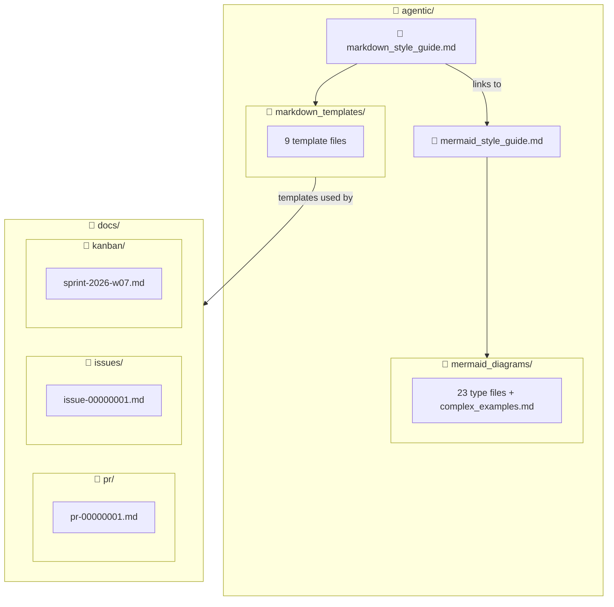

# Issue-00000001: Create Agent-Optimized Documentation System

| Field              | Value                                                  |
| ------------------ | ------------------------------------------------------ |
| **Issue**          | [#1](https://github.com/borealBytes/opencode/issues/1) |
| **Type**           | ✨ Feature request                                     |
| **Priority**       | P1                                                     |
| **Requester**      | Human                                                  |
| **Assignee**       | Human + AI agents                                      |
| **Date requested** | 2026-02-13                                             |
| **Status**         | In progress                                            |
| **Target release** | Sprint W07 2026                                        |
| **Shipped in**     | [PR-#1](../pr/pr-00000001.md) (in progress)            |

---

## 📋 Summary

### Problem statement

The `opencode` repo has accumulated agentic documentation files (ADRs, workflow guides, coding standards, custom instructions) but lacks a unified style system for markdown and diagrams. AI agents writing documentation produce inconsistent formatting — different heading styles, no citation standards, flowcharts used where sequence diagrams or ER diagrams would be more appropriate. Mermaid diagrams are underused and unstyled. There's no standard for how PRs, issues, or project tracking should be documented — and what project management data does exist lives locked inside GitHub's UI where agents can't access it without API tokens.

### Proposed solution

Build a complete, agent-optimized documentation system:

1. **Mermaid style guide** covering all 23 diagram types with exemplars, tested color palette, and accessibility rules
2. **Markdown style guide** with citation requirements, collapsible sections, emoji conventions, and full Mermaid integration table
3. **9 document templates** for every common document type (presentations, research papers, project docs, ADRs, how-to guides, status reports, PRs, issues, kanban boards)
4. **"Everything is Code" philosophy** — PRs, issues, and kanban boards managed as markdown files in `docs/`, not locked in GitHub's database
5. **Filled example files** demonstrating the templates with real project data

### User story

> As an **AI agent working in this repo**, I want a **comprehensive style guide and template library** so that **every document I produce is consistent, professional, and follows the team's conventions without needing per-document instructions**.

---

## 🎯 Acceptance Criteria

The feature is complete when:

- [x] Mermaid style guide covers all 23 diagram types with exemplar, tips, and template per type
- [x] Mermaid diagrams use approved 7-color palette tested in GitHub light and dark mode
- [x] Complex diagram examples exist for 11+ diagram types
- [x] 3 composition patterns documented (overview+detail, multi-perspective, before/after)
- [x] Markdown style guide covers headings, text, lists, links/citations, images, tables, code, collapsible sections, emoji, and Mermaid integration
- [x] 9 document templates created and cross-linked to both style guides
- [x] PR template includes security, breaking changes, deployment, and observability sections (2026 standard)
- [x] Issue template includes customer impact, workaround, SLA tracking, and investigation log
- [x] Kanban template includes aging indicators, flow efficiency, and lead time metrics
- [x] "Everything is Code" philosophy section added to markdown style guide
- [x] Philosophy woven into PR, issue, and kanban template introductions
- [x] Filled example files in `docs/pr/`, `docs/issues/`, `docs/kanban/` using real project data
- [ ] All Mermaid diagrams verified rendering on GitHub (light + dark mode)
- [ ] Files merged to main branch
- [x] All 10 legacy agentic files rewritten/cleaned (no Merge/Perplexity/Cloudflare references)
- [x] `AGENTS.md` created at repo root — routes agents to style guides before any doc/diagram work
- [x] `perplexity/` directory deleted
- [x] Example files (PR, issue, kanban) updated to reflect all cleanup work
- [x] Cross-link audit passed — all internal references resolve to real files

---

## 📐 Design

### File structure

### Technical considerations

- **No build step** — pure markdown rendered by GitHub, no static site generator
- **Mermaid parser quirks** — architecture diagrams can't have hyphens or emoji in `[]` labels; requirement diagrams need numeric IDs; C4 needs `UpdateRelStyle()` offsets
- **GitHub version constraints** — ZenUML may not render; treemap and radar are very new diagram types
- **Color palette** — 7 `classDef` classes tested in both light and dark GitHub themes
- **Existing files** — the `agentic/` directory already contains ADRs, workflow guides, and agent instructions that need to coexist with the new documentation system

<strong>📋 Implementation Notes</strong>

**Mermaid parser gotchas discovered during development:**

| Diagram type | Gotcha                                                                                       |
| ------------ | -------------------------------------------------------------------------------------------- |
| Architecture | No emoji in `[]` labels, no hyphens — parsed as edge operators                               |
| Requirement  | `id` must be numeric, `risk`/`verifymethod` must be lowercase                                |
| C4           | Long descriptions cause overlaps — use `UpdateRelStyle()` with offsets on every relationship |
| Flowchart    | The word `end` as standalone ID breaks parsing                                               |
| Sankey       | No emoji support in node names                                                               |
| Kanban       | No `accTitle`/`accDescr` support — use italic Markdown paragraph above                       |

**Approved color palette (tested GitHub light + dark):**

| Class   | Fill / Stroke         | Use               |
| ------- | --------------------- | ----------------- |
| Primary | `#dbeafe` / `#1e40af` | Default emphasis  |
| Success | `#dcfce7` / `#166534` | Positive outcomes |
| Warning | `#fef3c7` / `#92400e` | Caution           |
| Danger  | `#fee2e2` / `#991b1b` | Errors, risks     |
| Neutral | `#f3f4f6` / `#374151` | Background        |
| Accent  | `#ede9fe` / `#5b21b6` | Highlight         |
| Warm    | `#ffedd5` / `#9a3412` | Attention         |

**Total file inventory (new files in this effort):**

- `mermaid_style_guide.md` (~454 lines)
- `markdown_style_guide.md` (~730 lines)
- 24 files in `mermaid_diagrams/`
- 9 files in `markdown_templates/`
- 3 files in `docs/` (PR, issue, kanban examples)

---

## 📊 Impact

| Dimension           | Assessment                                                                                 |
| ------------------- | ------------------------------------------------------------------------------------------ |
| **Users affected**  | All AI agents and humans working in this repo                                              |
| **Revenue impact**  | Indirect — faster, more consistent documentation reduces review cycles and onboarding time |
| **Effort estimate** | L — 36+ new files across two style guides, 9 templates, 23 diagram types, 3 examples       |
| **Dependencies**    | None — self-contained documentation system                                                 |

### Success metrics

- **Agent output consistency:** Agents following these guides produce docs that need 0 formatting corrections → measured by review feedback on first 10 PRs after merge
- **Template adoption:** 100% of new PRs and issues use the templates within 2 weeks
- **Diagram usage:** Mermaid diagrams appear in 50%+ of documents that describe flow, structure, or relationships

---

## 🔗 References

- [Mermaid Style Guide](../../agentic/mermaid_style_guide.md)
- [Markdown Style Guide](../../agentic/markdown_style_guide.md)
- [PR-#1: Agentic documentation system + repo cleanup](../pr/pr-00000001.md)
- [Sprint board](../kanban/sprint-2026-w07.md)

---

_Last updated: 2026-02-13_
