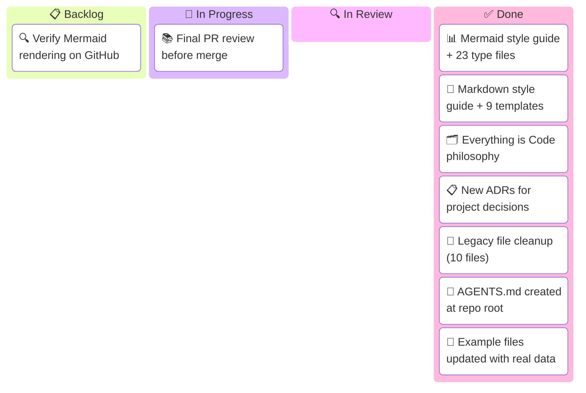

# Sprint W07 2026 — Kanban Board

_Sprint W07: Feb 10–14, 2026 · opencode repo_
_Human · Last updated: 2026-02-13 16:30_

---

## 📋 Board Overview

**Period:** 2026-02-10 → 2026-02-14
**Goal:** Ship the agentic documentation system (Mermaid + Markdown guides, templates, Everything is Code), clean up repo from ported files, and merge to main.
**WIP Limit:** 3 items In Progress

### Visual board

_Kanban board showing Sprint W07 work distribution across four workflow columns:_

---

## 🚦 Board Status

| Column             | Count | WIP Limit | Status                                    |
| ------------------ | ----- | --------- | ----------------------------------------- |
| 📋 **Backlog**     | 1     | —         | Mermaid rendering verification after push |
| 🔄 **In Progress** | 1     | 3         | 🟢 Under limit                            |
| 🔍 **In Review**   | 0     | —         | —                                         |
| ✅ **Done**        | 7     | —         | Core system + legacy cleanup complete     |
| 🚫 **Blocked**     | 0     | —         | Clear                                     |

---

## 📋 Backlog

_Prioritized top-to-bottom. Top items are next to be pulled._

| #   | Item                                              | Priority | Estimate | Assignee | Notes                                                                 |
| --- | ------------------------------------------------- | -------- | -------- | -------- | --------------------------------------------------------------------- |
| 1   | Verify Mermaid rendering on GitHub (light + dark) | 🔴 High  | S        | Human    | Push branch, check architecture/requirement/C4/radar/treemap diagrams |

---

## 🔄 In Progress

| Item                         | Assignee | Started | Expected | Days in column | Aging | Status                                    |
| ---------------------------- | -------- | ------- | -------- | -------------- | ----- | ----------------------------------------- |
| Final PR review before merge | Human    | Feb 13  | Feb 14   | 0              | 🟢    | 🟢 All work complete, reviewing for merge |

> ⚠️ **WIP limit:** 1 / 3. Under limit.

> 💡 **Aging indicator:** 🟢 Under expected time · 🟡 At expected time · 🔴 Over expected time — items aging red need attention or re-scoping.

---

## 🔍 In Review

| Item                   | Author | Reviewer | PR  | Days in review | Aging | Status |
| ---------------------- | ------ | -------- | --- | -------------- | ----- | ------ |
| _(No items in review)_ |        |          |     |                |       |        |

---

## ✅ Done

_Completed this sprint._

| Item                                                                   | Assignee   | Completed | Cycle time | PR                         |
| ---------------------------------------------------------------------- | ---------- | --------- | ---------- | -------------------------- |
| Mermaid style guide + 24 diagram files (23 types + complex examples)   | Human + AI | Feb 13    | 1 day      | [#1](../pr/pr-00000001.md) |
| Markdown style guide + 9 templates (upgraded to 2026 standards)        | Human + AI | Feb 13    | 1 day      | [#1](../pr/pr-00000001.md) |
| "Everything is Code" philosophy — woven into style guide + 3 templates | Human + AI | Feb 13    | 1 day      | [#1](../pr/pr-00000001.md) |
| New ADRs (docs system, Mermaid standards, Everything is Code)          | Human + AI | Feb 13    | 1 day      | [#1](../pr/pr-00000001.md) |
| Legacy file cleanup — 10 files rewritten/cleaned, perplexity/ deleted  | Human + AI | Feb 13    | 1 day      | [#1](../pr/pr-00000001.md) |
| AGENTS.md created at repo root — routes agents to style guides         | Human + AI | Feb 13    | 1 day      | [#1](../pr/pr-00000001.md) |
| Example files (PR, issue, kanban) updated to reflect all cleanup work  | Human + AI | Feb 13    | 1 day      | [#1](../pr/pr-00000001.md) |

---

## 🚫 Blocked

| Item                             | Assignee | Blocked since | Blocked by | Escalated to | Unblock action |
| -------------------------------- | -------- | ------------- | ---------- | ------------ | -------------- |
| _(No blocked items this sprint)_ |          |               |            |              |                |

---

## 📊 Metrics

### This period

| Metric                             | Value   | Target | Trend |
| ---------------------------------- | ------- | ------ | ----- |
| **Throughput** (items completed)   | 7       | 4      | ↑     |
| **Avg cycle time** (start → done)  | 1.0 day | —      | —     |
| **Avg lead time** (created → done) | 1.0 day | —      | —     |
| **Avg review time**                | —       | —      | —     |
| **Flow efficiency**                | ~85%    | 40%    | ↑     |
| **Blocked items**                  | 0       | 0      | →     |
| **WIP limit breaches**             | 0       | 0      | →     |
| **Items aging red**                | 0       | 0      | →     |

> 💡 **Flow efficiency** = active work time ÷ total cycle time × 100. A healthy team targets 40%+. Below 15% means items spend most of their time waiting, not being worked on.

> 📌 **Note:** This is the first sprint using this kanban template. Historical data begins next period.

---

## 📝 Board Notes

### Decisions made this period

- **Feb 13:** Decided to build comprehensive documentation system rather than lightweight linter approach — see [ADR-001](../../agentic/adr/ADR-001-agent-optimized-documentation-system.md)
- **Feb 13:** Chose `classDef` palette over `%%{init}` theming for Mermaid — see [ADR-002](../../agentic/adr/ADR-002-mermaid-diagram-standards.md)
- **Feb 13:** Adopted "Everything is Code" for project management — see [ADR-003](../../agentic/adr/ADR-003-everything-is-code.md)
- **Feb 13:** Removed all 7 ported ADRs (perplexity spaces, monorepo structure, Walmart procurement, USB backup, etc.) — not relevant to this project
- **Feb 13:** Upgraded PR template to 2026 standards: added security review, breaking changes, deployment strategy, observability plan sections
- **Feb 13:** Upgraded issue template: added customer impact quantification, workaround section, SLA tracking
- **Feb 13:** Upgraded kanban template: added aging indicators, flow efficiency, lead time metrics
- **Feb 13:** Rewrote example files from fictional payment scenario to real project data (this documentation system)

### Carryover from last period

- N/A — first sprint for this project

### Upcoming dependencies

- **Feb 14:** GitHub rendering verification needed before merge — architecture, requirement, C4, radar, treemap diagrams are most fragile
- ~~**Post-merge:** AGENTS.md needs an entry pointing agents to the style guides~~ — Done: `AGENTS.md` created at repo root

---

## 🔗 References

- [Issue-#1: Create agent-optimized documentation system](../issues/issue-00000001.md)
- [PR-#1: Agentic documentation system + repo cleanup](../pr/pr-00000001.md)
- [ADR-001: Documentation system decision](../../agentic/adr/ADR-001-agent-optimized-documentation-system.md)
- [ADR-002: Mermaid standards decision](../../agentic/adr/ADR-002-mermaid-diagram-standards.md)
- [ADR-003: Everything is Code decision](../../agentic/adr/ADR-003-everything-is-code.md)

---

_Next update: 2026-02-14 17:00 · Board owner: Human_
