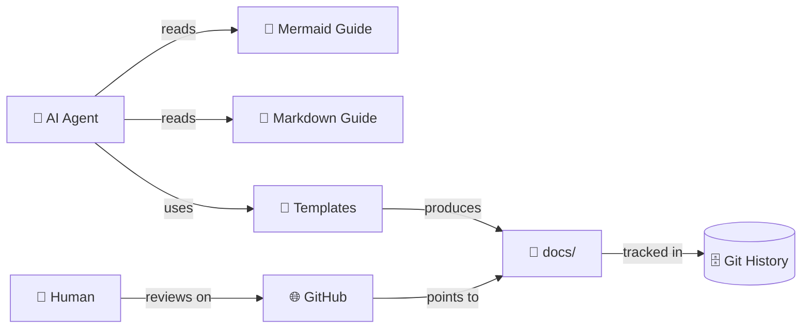

# PR-00000001: Add Agentic Documentation System and Repo Cleanup

| Field               | Value                                                          |
| ------------------- | -------------------------------------------------------------- |
| **PR**              | [#1](https://github.com/borealBytes/opencode/pull/1)           |
| **Author**          | Clayton Young ([@borealBytes](https://github.com/borealBytes)) |
| **Date**            | 2026-02-13                                                     |
| **Status**          | Open                                                           |
| **Branch**          | `feat/agentic-docs-system` → `main`                            |
| **Related issues**  | [#1](../issues/issue-00000001.md)                              |
| **Deploy strategy** | Standard (docs-only, no runtime impact)                        |

---

## 📋 Summary

### What changed and why

The `opencode` repo needed a unified documentation system that AI agents can follow without per-document instructions. This PR adds a complete Mermaid style guide (23 diagram types), a Markdown style guide, 9 document templates, the "Everything is Code" project management philosophy, and filled example files — plus general repo cleanup of accumulated files.

Without this system, every agent-generated document was formatted differently, diagrams were inconsistent, and project management data was trapped in GitHub's UI. Now agents read the style guides and produce consistent, professional output. PRs, issues, and kanban boards live as committed files.

### Impact classification

| Dimension         | Level             | Notes                                                                                    |
| ----------------- | ----------------- | ---------------------------------------------------------------------------------------- |
| **Risk**          | 🟢 Low            | Documentation only — no runtime code changes                                             |
| **Scope**         | Broad             | 36+ new files, 10 rewritten/cleaned files, 1 deleted dir, touches `agentic/` and `docs/` |
| **Reversibility** | Easily reversible | Revert commit removes all new files, no migration needed                                 |
| **Security**      | None              | No code, config, or credential changes                                                   |

---

## 🔍 Changes

### Change inventory

| File / Area                                                   | Change type | Description                                                                                                                  |
| ------------------------------------------------------------- | ----------- | ---------------------------------------------------------------------------------------------------------------------------- |
| `agentic/mermaid_style_guide.md`                              | Added       | Core Mermaid guide — emoji, color palette, accessibility, complexity tiers, diagram selection table                          |
| `agentic/mermaid_diagrams/` (24 files)                        | Added       | Per-type files: exemplar, tips, template, complex examples for all 23 diagram types + composition patterns                   |
| `agentic/markdown_style_guide.md`                             | Added       | Core Markdown guide — headings, citations, collapsible sections, emoji, Mermaid integration, "Everything is Code" philosophy |
| `agentic/markdown_templates/` (9 files)                       | Added       | Templates: presentation, research paper, project docs, decision record, how-to, status report, PR, issue, kanban             |
| `agentic/adr/ADR-001-agent-optimized-documentation-system.md` | Added       | Why we built a comprehensive in-repo guide system instead of a linter or external site                                       |
| `agentic/adr/ADR-002-mermaid-diagram-standards.md`            | Added       | Why `classDef` palette over `%%{init}`, emoji rules, complexity tiers                                                        |
| `agentic/adr/ADR-003-everything-is-code.md`                   | Added       | Why PRs/issues/kanban live as committed files, not in GitHub's database                                                      |
| `agentic/adr/ADR-001-perplexity-spaces.md` (+ 6 others)       | Deleted     | Ported from another project, not relevant — Walmart procurement, USB backup, etc.                                            |
| `docs/pr/pr-00000001.md`                                      | Added       | This PR's own documentation (self-referential, naturally)                                                                    |
| `docs/issues/issue-00000001.md`                               | Added       | Feature request for the documentation system                                                                                 |
| `docs/kanban/sprint-2026-w07.md`                              | Added       | Sprint W07 board tracking this work                                                                                          |
| `agentic/README.md`                                           | Rewritten   | Generic agentic framework overview with Mermaid architecture diagram                                                         |
| `agentic/instructions.md`                                     | Rewritten   | Generic agent entry point with doc standards routing                                                                         |
| `agentic/file_organization.md`                                | Rewritten   | Generic repo structure map with complete file tree                                                                           |
| `agentic/custom-instructions.md`                              | Rewritten   | Fillable project-specific rules template with `<!-- CUSTOMIZE -->` markers                                                   |
| `agentic/agentic_coding.md`                                   | Cleaned     | Removed Merge/Cloudflare refs, genericized CAN/MUST/NEVER + workflow                                                         |
| `agentic/autonomy_boundaries.md`                              | Cleaned     | Removed project-specific escalation sections, added generic equivalents                                                      |
| `agentic/workflow_guide.md`                                   | Cleaned     | Genericized 14-step workflow examples and commands                                                                           |
| `agentic/contribute_standards.md`                             | Cleaned     | Updated file-based PR convention to `docs/pr/pr-NNNNNNNN.md`, added style guide links                                        |
| `agentic/operational_readiness.md`                            | Cleaned     | Removed Perplexity/Merge sections, made tool-agnostic                                                                        |
| `agentic/context_budget_guide.md`                             | Cleaned     | Replaced "Thread" with "session", removed Perplexity branding, model-agnostic                                                |
| `agentic/perplexity/`                                         | Deleted     | Platform-specific directory, not relevant to template repo                                                                   |
| `AGENTS.md`                                                   | Added       | Root-level agent entry point — routes to style guides before any doc/diagram work                                            |

### Architecture impact

This PR doesn't change runtime architecture. It establishes a documentation architecture:



<details>
<summary><strong>📋 Detailed Change Notes</strong></summary>

**Mermaid style guide scope:**

- Core guide: ~454 lines covering Quick Start, Core Principles, Accessibility, Theme Config, 40+ Approved Emoji, 7-color palette with visual preview, Node Naming/Labels/Shapes, Bold Text, Subgraphs, Managing Complexity (4-tier system), Diagram Selection Table (23 types), Parser Gotchas, Quality Checklist
- 23 diagram type files: flowchart, sequence, class, state, ER, gantt, pie, git graph, mindmap, timeline, user journey, quadrant, requirement, C4, sankey, XY chart, block, kanban, packet, architecture, radar, treemap, ZenUML
- Complex examples for 11 types + 3 composition patterns

**Markdown style guide scope:**

- Core guide: ~730 lines covering 8 Core Principles, "Everything is Code" philosophy, Document Structure, Text Formatting, Lists, Links/Citations, Images, Tables, Code Blocks, Collapsible Sections, Emoji, Mermaid Integration (full 22-type table), Templates (9), File Conventions, Quality Checklist
- PR template upgraded to 2026 standards: security review, breaking changes, deployment strategy, observability plan
- Issue template upgraded: customer impact quantification, workaround section, SLA tracking, success metrics
- Kanban template upgraded: aging indicators, flow efficiency, lead time

**Parser gotchas documented:**

| Diagram      | Gotcha                                                       |
| ------------ | ------------------------------------------------------------ |
| Architecture | No emoji or hyphens in `[]` labels                           |
| Requirement  | `id` must be numeric, risk/verifymethod lowercase            |
| C4           | Long descriptions cause overlaps — needs `UpdateRelStyle()`  |
| Flowchart    | `end` as standalone ID breaks parser                         |
| Sankey       | No emoji in node names                                       |
| Kanban       | No `accTitle`/`accDescr` — needs Markdown paragraph fallback |

**ADR cleanup and creation:**

- Removed 7 ADRs ported from another project (perplexity spaces, monorepo structure, idempotent scripts, error recovery, USB backup infrastructure, Walmart procurement, development platform strategy) — none were relevant to this project
- Created 3 new ADRs documenting the actual decisions made during this work:
  - ADR-001: Why comprehensive in-repo guides over linter or external site
  - ADR-002: Why `classDef` + emoji over `%%{init}` or no styling
  - ADR-003: Why committed files over GitHub API or auto-sync for project management

**Legacy file cleanup (10 files rewritten/cleaned):**

- 4 files fully rewritten: `README.md`, `instructions.md`, `file_organization.md`, `custom-instructions.md`
- 6 files cleaned: `agentic_coding.md`, `autonomy_boundaries.md`, `workflow_guide.md`, `contribute_standards.md`, `operational_readiness.md`, `context_budget_guide.md`
- All Merge/Perplexity/Cloudflare/XMR references removed
- All files now generic, agent-first, suitable as template repo
- `perplexity/` directory deleted
- `AGENTS.md` created at repo root — routes agents to style guides before any work

</details>

---

## 🧪 Testing

### How to verify

```bash
# 1. Verify all markdown files are valid
find agentic/ docs/ -name "*.md" | head -20

# 2. Check cross-links aren't broken (relative paths)
grep -r "](../" agentic/markdown_templates/ | head -20
grep -r "](../" docs/ | head -20

# 3. Visual verification — push to a branch and check GitHub rendering
# Focus on: architecture, requirement, C4, radar, treemap diagrams
# Verify light mode AND dark mode
```

### Test coverage

| Test type         | Status     | Notes                                          |
| ----------------- | ---------- | ---------------------------------------------- |
| Unit tests        | ⬜ N/A     | Documentation-only PR                          |
| Integration tests | ⬜ N/A     | No runtime code                                |
| Manual testing    | 🟡 Partial | Cross-links verified, GitHub rendering pending |
| Performance       | ⬜ N/A     | No runtime impact                              |

### Edge cases considered

- **Mermaid parser fragility** — architecture, requirement, and C4 diagrams have known parser quirks. All documented in the style guide with workarounds. Need GitHub rendering verification.
- **GitHub dark mode** — color palette tested for both themes. 7 `classDef` classes use fill/stroke combos that maintain contrast in both modes.
- **ZenUML support** — may not render on GitHub (requires external plugin). Documented as a caveat in the type file.

---

## 🔒 Security

### Security checklist

- [x] No secrets, credentials, API keys, or PII in the diff
- [x] Authentication/authorization changes reviewed — N/A
- [x] Input validation added — N/A
- [x] Injection protections maintained — N/A
- [x] Dependencies scanned — no dependencies added
- [x] Data encryption maintained — N/A

**Security impact:** None — documentation files only.

---

## ⚡ Breaking Changes

**This PR introduces breaking changes:** No

New files only. No existing files are modified in ways that break current workflows. Existing `agentic/` files (ADRs, workflow guides, instructions) remain in place and are compatible with the new documentation system.

---

## 🔄 Rollback Plan

**Revert command:**

```bash
git revert [commit-sha]
```

**Additional steps needed:**

- [ ] None — reverting removes documentation files only. No runtime impact.

> ⚠️ **Rollback risk:** Minimal. Reverting removes the style guides and templates. Any documents already created using the templates will still be valid markdown — they just won't have the template to reference anymore.

---

## 🚀 Deployment

### Strategy

**Approach:** Standard merge — documentation only, no staged rollout needed.

**Feature flags:** None.

### Pre-deployment

- [ ] Verify all Mermaid diagrams render on GitHub (push branch, check rendering)
- [ ] Spot-check cross-links from templates to style guides
- [ ] Confirm `docs/` directory structure matches the file conventions in the style guide

### Post-deployment verification

- [ ] Style guides render correctly on GitHub main branch
- [ ] All 23 Mermaid diagram type files render their exemplar diagrams
- [ ] Example files in `docs/` cross-reference each other correctly
- [ ] Color palette renders correctly in both GitHub light and dark mode

---

## 📡 Observability

### Monitoring

- **Dashboard:** N/A — documentation-only change
- **Key metrics to watch:** N/A
- **Watch window:** N/A

### Alerts

- No alert changes needed

### Logging

- No logging changes

### Success criteria

All files render correctly on GitHub. Agents following the style guides produce consistent documentation on the next PR that uses the templates.

---

## ✅ Reviewer Checklist

- [x] Code follows project style guide and linting rules — this PR _creates_ the style guide
- [x] No `TODO` or `FIXME` comments introduced without linked issues
- [x] Error handling covers failure modes — N/A
- [x] No secrets, credentials, or PII in the diff
- [x] Tests cover the happy path — manual rendering verification
- [x] Documentation updated — this PR IS the documentation
- [x] Database migrations are reversible — N/A
- [x] Performance impact considered — N/A, docs only
- [ ] Breaking changes documented — N/A, no breaking changes
- [ ] Feature flag configured correctly — N/A
- [ ] Monitoring/alerting updated — N/A
- [ ] Security review completed — N/A

---

## 💬 Discussion

### Release note

**Category:** Feature

> Added comprehensive agent-optimized documentation system: Mermaid style guide (23 diagram types), Markdown style guide, 9 document templates, and "Everything is Code" project management system with PR/issue/kanban tracking as committed files.

### Key review decisions

- **"Everything is Code" approach:** PRs, issues, and kanban boards are managed as markdown files in `docs/` rather than relying on GitHub's database. GitHub remains the UI for commenting, reviewing diffs, and watching CI — but the actual content lives in committed files. This makes project management data portable (GitHub → GitLab → anywhere) and AI-native (agents read local files, no API needed). See [ADR-003](../../agentic/adr/ADR-003-everything-is-code.md).
- **`classDef` over `%%{init}` for Mermaid:** `%%{init}` directives override GitHub's theme engine, breaking dark mode. `classDef` with tested colors works in both themes. See [ADR-002](../../agentic/adr/ADR-002-mermaid-diagram-standards.md).
- **Comprehensive guides over linter:** Linters enforce syntax, not quality. They can't teach agents to pick sequence diagrams over flowcharts. The guides teach decision-making, not just formatting. See [ADR-001](../../agentic/adr/ADR-001-agent-optimized-documentation-system.md).
- **ADR cleanup:** Removed all 7 ported ADRs from another project. Replaced with 3 ADRs documenting actual decisions made during this work.
- **Template scope:** 9 templates covers the most common document types across industries. Additional templates can be added later without restructuring.
- **2026 PR template upgrades:** Added security review, breaking changes, deployment strategy, and observability sections based on research of top engineering org patterns (Home Assistant, Chroma, GitHub MCP server, Gruntwork, etc.).

### Follow-up items

- [ ] Verify all Mermaid diagrams render on GitHub (architecture, requirement, C4, radar, treemap are most fragile)
- [x] ~~Add AGENTS.md entry pointing to the style guides~~ — Done: `AGENTS.md` created at repo root
- [x] ~~Evaluate whether remaining ported agentic files need updating or removal~~ — Done: all 10 legacy files rewritten/cleaned

---

## 🔗 References

- [Issue-#1: Create agent-optimized documentation system](../issues/issue-00000001.md)
- [Mermaid Style Guide](../../agentic/mermaid_style_guide.md)
- [Markdown Style Guide](../../agentic/markdown_style_guide.md)
- [ADR-001: Documentation system decision](../../agentic/adr/ADR-001-agent-optimized-documentation-system.md)
- [ADR-002: Mermaid standards decision](../../agentic/adr/ADR-002-mermaid-diagram-standards.md)
- [ADR-003: Everything is Code decision](../../agentic/adr/ADR-003-everything-is-code.md)
- [Sprint board](../kanban/sprint-2026-w07.md)

---

_Last updated: 2026-02-13_
