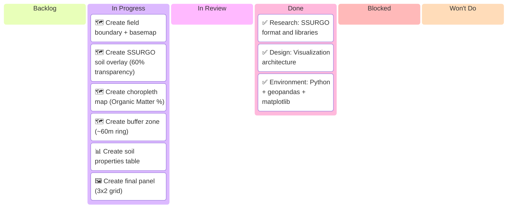

# Feature: Vector SSURGO Visualizations — Kanban Board

_Feature: Vector SSURGO Visualizations · Started: 2026-03-11_
_Last updated: 2026-03-11 (initial visualization complete)_

---

## 📋 Board Overview

**Goal:** Implement vector-based SSURGO data visualizations
**WIP Limit:** 3 items In Progress

### Visual board

> ⚠️ **Always show all 6 columns** — Even if a column has no items, include it with a placeholder.

---

## 🚦 Board Status

| Column             | Count | WIP Limit | Status                        |
| ------------------ | ----- | --------- | ----------------------------- |
| 📋 **Backlog**     | 0     | —         | —                             |
| 🔄 **In Progress** | 6     | 3         | 🔶 Visualizations in progress |
| 🔍 **In Review**   | 0     | —         | —                             |
| ✅ **Done**        | 3     | —         | Research + design complete    |
| 🚫 **Blocked**     | 0     | —         | Clear                         |

---

## 📝 Notes

_Research phase: Evaluate D3.js, Leaflet, deck.gl, and Mapbox GL JS for vector tile rendering._

---

## 🔗 Links

- [PR #6](../pr/pr-00000006-vector-ssurgo-visualizations.md)
- [Issue #6](../issues/issue-00000006-vector-ssurgo-visualizations.md)
