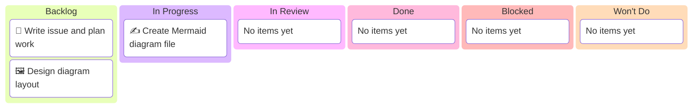

# Chip Market Share Diagram — Kanban Board

_Project: Create a complex Mermaid diagram of major chip companies with market shares_
_Human · Last updated: 2026-03-02_

---

## 📋 Board Overview

**Period:** 2026-03-02 → 2026-03-04  
**Goal:** Complete the documentation example with a Mermaid diagram in `docs/`  
**WIP Limit:** 2 items In Progress

### Visual board

> ⚠️ Always show all 6 columns — Even if a column has no items, include it with a placeholder.

---

## 🚦 Board Status

| Column             | Count | WIP Limit | Status                 |
| ------------------ | ----- | --------- | ---------------------- |
| 📋 **Backlog**     | 2     | —         | Ready to start         |
| 🔄 **In Progress** | 1     | 2         | Work has begun         |
| 🔍 **In Review**   | 0     | —         | —                      |
| ✅ **Done**        | 0     | —         | —                      |
| 🚫 **Blocked**     | 0     | —         | —                      |
| 🚫 **Won't Do**    | 0     | —         | —                      |

---

## 📋 Backlog

| #   | Item                        | Priority | Estimate | Assignee | Notes                              |
| --- | --------------------------- | -------- | -------- | -------- | ---------------------------------- |
| 1   | Draft Mermaid diagram       | 🔴 High  | 30 min   | Human    | Pie/treemap of vendor market share |
| 2   | Add diagram file to `docs`  | 🔴 High  | 15 min   | Human    | Uses style guide conventions       |
|     | _[No items yet]_            |          |          |          |                                    |

---

## 🔄 In Progress

| Item                         | Assignee | Started    | Expected   | Days in column | Aging | Status  |
| ---------------------------- | -------- | ---------- | ---------- | -------------- | ----- | ------- |
| Create Mermaid diagram file  | Human    | 2026-03-02 | 2026-03-02 | 0              | 🟢    | 🟢 On track |

---

## 🔍 In Review

| Item           | Author | Reviewer | PR  | Days in review | Aging | Status           |
| -------------- | ------ | -------- | --- | -------------- | ----- | ---------------- |
| [No items yet] |        |          |     |                |       | _[No items yet]_ |

---

## ✅ Done

| Item                     | Assignee | Completed  | Cycle time | PR/Issue |
| ------------------------ | -------- | ---------- | ---------- | -------- |
| [No items yet]           |          |            |            |          |

---

## 🚫 Blocked

| Item           | Assignee | Blocked since | Blocked by | Unblock action       |
| -------------- | -------- | ------------- | ---------- | -------------------- |
| [No items yet] |          |               |            | _[No blocked items]_ |

---

## 🚫 Won't Do

| Item           | Date decided | Decision owner | Rationale                        | Revisit trigger |
| -------------- | ------------ | -------------- | -------------------------------- | --------------- |
| [No items yet] |              |                | _[No items explicitly declined]_ |                 |

---

_Next update: 2026-03-03 or upon progress · Board owner: Human_
