# Sprint W07 2026 — Kanban Board

_Sprint W07: Feb 10–14, 2026 · opencode repo_
_Human · Last updated: 2026-02-14 20:08_

---

## 📋 Board Overview

**Period:** 2026-02-10 → 2026-02-14
**Goal:** Ship the agentic documentation system plus production-ready local CI/CrewAI review reliability improvements, root scaffolding, and idempotent script standards.
**WIP Limit:** 3 items In Progress

### Visual board

_Kanban board showing Sprint W07 work distribution across four workflow columns:_

```mermaid
kanban
    column1["📋 Backlog"]
        task1["🔍 Verify Mermaid rendering on GitHub"]
        task14["✅ Commit and push current uncommitted work"]

    column2["🔧 In Progress"]
        task10["🤖 Stabilize NVIDIA Kimi quick-review success path"]

    column3["🔍 In Review"]

    column4["✅ Done"]
        task6["📊 Mermaid style guide + 23 type files"]
        task7["📝 Markdown style guide + 9 templates"]
        task8["🗂️ Everything is Code philosophy"]
        task9["📋 New ADRs for project decisions"]
        task3["🧹 Legacy file cleanup (10 files)"]
        task4["📄 AGENTS.md created at repo root"]
        task5["🤖 CrewAI review bug fixes (5/5)"]
        task11["📓 notebooks/ + src/ scaffolding added"]
        task12["♻️ Idempotent script guide + read-in wiring"]
        task13["🧪 Local --review rerun passes end-to-end"]
        task15["💰 Local pricing/cost breakdown shown in terminal output"]
        task16["⚡ Fail-fast timeout guard for no-response/out-of-credit paths"]
        task17["🧾 Cost tracker parity verified (non-empty audit table)"]
        task18["🧹 markdownlint excludes .crewai/workspace artifacts"]
        task19["✅ Full ./scripts/ci-local.sh --review pass verified"]
        task20["📚 AGENTS completion gate + ADR-004 source-of-truth sync"]
        task21["🔁 Live progress sync loop enforced in AGENTS/workflow docs"]
        task22["🧪 ci-local pre-push rule + hosted-env skip rationale policy"]
        task23["⚡ NVIDIA timeout handling hardened with explicit error surfacing"]
        task24["🧠 Local quick-review now runs 3 reviewer passes with per-pass summaries"]
        task25["📐 Local pricing/cost panel now renders aligned terminal columns"]
        task26["🗂️ Monorepo layout modernized: website moved to apps/web"]
        task27["🏗️ New workspace scaffold: apps/services/packages/data-sql"]
        task28["📚 Federated ADR governance added (global + subsystem logs)"]
        task29["🤖 CrewAI local ADR log created with initial subsystem ADRs"]
        task30["🧭 Global baseline ADR added for monorepo decision map"]
        task31["🔁 CrewAI provider chain clarified (NVIDIA -> OpenRouter)"]
        task32["🧱 CI regrouped into stage gates with CrewAI review last"]
        task33["🧪 Local CI parity rerun passed after stage-gate regrouping"]
        task34["🧩 CI README Mermaid parse error fixed and phase naming normalized"]
        task35["🔒 CI/deploy concurrency guards added and stage-gate dependencies clarified"]
        task36["🧪 Post-hardening local CI parity rerun completed; quick-review instability remains tracked"]
        task37["🧼 Phase-1 commitlint ELIFECYCLE lifecycle noise removed in local CI"]
        task38["🧪 Full local CI rerun passed after commitlint UX polish"]
```

---

## 🚦 Board Status

| Column             | Count | WIP Limit | Status                              |
| ------------------ | ----- | --------- | ----------------------------------- |
| 📋 **Backlog**     | 2     | —         | Rendering check + pending commit    |
| 🔄 **In Progress** | 1     | 3         | 🟢 Under limit                      |
| 🔍 **In Review**   | 0     | —         | —                                   |
| ✅ **Done**        | 34    | —         | Core docs + CI/review + scaffolding |
| 🚫 **Blocked**     | 0     | —         | Clear                               |

---

## 📋 Backlog

_Prioritized top-to-bottom. Top items are next to be pulled._

| #   | Item                                                    | Priority | Estimate | Assignee | Notes                                                                 |
| --- | ------------------------------------------------------- | -------- | -------- | -------- | --------------------------------------------------------------------- |
| 1   | Verify Mermaid rendering on GitHub (light + dark)       | 🔴 High  | S        | Human    | Push branch, check architecture/requirement/C4/radar/treemap diagrams |
| 2   | Commit and push current uncommitted reliability updates | 🔴 High  | S        | Human    | Include provider routing, fail-fast timeout, and doc updates          |

---

## 🔄 In Progress

| Item                                            | Assignee | Started | Expected | Days in column | Aging | Status                                                           |
| ----------------------------------------------- | -------- | ------- | -------- | -------------- | ----- | ---------------------------------------------------------------- |
| Stabilize NVIDIA Kimi quick-review success path | Human    | Feb 13  | Feb 14   | 0              | 🟡    | 🟡 Fail-fast and timeout guards done; quality still inconsistent |

> ⚠️ **WIP limit:** 1 / 3. Under limit.

> 💡 **Aging indicator:** 🟢 Under expected time · 🟡 At expected time · 🔴 Over expected time — items aging red need attention or re-scoping.

---

## 🔍 In Review

| Item                   | Author | Reviewer | PR  | Days in review | Aging | Status |
| ---------------------- | ------ | -------- | --- | -------------- | ----- | ------ |
| _(No items in review)_ |        |          |     |                |       |        |

---

## ✅ Done

_Completed this sprint._

| Item                                                                                                                         | Assignee   | Completed | Cycle time | PR                                                                 |
| ---------------------------------------------------------------------------------------------------------------------------- | ---------- | --------- | ---------- | ------------------------------------------------------------------ |
| Mermaid style guide + 24 diagram files (23 types + complex examples)                                                         | Human + AI | Feb 13    | 1 day      | [#1](../pr/pr-00000001-agentic-docs-and-monorepo-modernization.md) |
| Markdown style guide + 9 templates (upgraded to 2026 standards)                                                              | Human + AI | Feb 13    | 1 day      | [#1](../pr/pr-00000001-agentic-docs-and-monorepo-modernization.md) |
| "Everything is Code" philosophy — woven into style guide + 3 templates                                                       | Human + AI | Feb 13    | 1 day      | [#1](../pr/pr-00000001-agentic-docs-and-monorepo-modernization.md) |
| New ADRs (docs system, Mermaid standards, Everything is Code)                                                                | Human + AI | Feb 13    | 1 day      | [#1](../pr/pr-00000001-agentic-docs-and-monorepo-modernization.md) |
| Legacy file cleanup — 10 files rewritten/cleaned, perplexity/ deleted                                                        | Human + AI | Feb 13    | 1 day      | [#1](../pr/pr-00000001-agentic-docs-and-monorepo-modernization.md) |
| AGENTS.md created at repo root — routes agents to style guides                                                               | Human + AI | Feb 13    | 1 day      | [#1](../pr/pr-00000001-agentic-docs-and-monorepo-modernization.md) |
| Example files (PR, issue, kanban) updated to reflect all cleanup work                                                        | Human + AI | Feb 13    | 1 day      | [#1](../pr/pr-00000001-agentic-docs-and-monorepo-modernization.md) |
| Local review pipeline fixes (5 bugs resolved in CrewAI + CI script)                                                          | Human + AI | Feb 13    | 1 day      | [#1](../pr/pr-00000001-agentic-docs-and-monorepo-modernization.md) |
| Added root scaffolding for `notebooks/` and `src/` with README files                                                         | Human + AI | Feb 13    | 1 day      | [#1](../pr/pr-00000001-agentic-docs-and-monorepo-modernization.md) |
| Added idempotent script design standards + read-in references                                                                | Human + AI | Feb 13    | 1 day      | [#1](../pr/pr-00000001-agentic-docs-and-monorepo-modernization.md) |
| End-to-end local `./scripts/ci-local.sh --review` rerun (passes; model outputs limited by external credit availability)      | Human + AI | Feb 13    | 1 day      | [#1](../pr/pr-00000001-agentic-docs-and-monorepo-modernization.md) |
| Local terminal now displays pricing/cost section from review summary                                                         | Human + AI | Feb 13    | 1 day      | [#1](../pr/pr-00000001-agentic-docs-and-monorepo-modernization.md) |
| Fail-fast timeout guard added (`CREWAI_REVIEW_TIMEOUT_SECONDS`, default 90s)                                                 | Human + AI | Feb 13    | 1 day      | [#1](../pr/pr-00000001-agentic-docs-and-monorepo-modernization.md) |
| NVIDIA timeout handling hardened (`CREWAI_NVIDIA_TIMEOUT_SECONDS`, explicit timeout error output)                            | Human + AI | Feb 13    | 1 day      | [#1](../pr/pr-00000001-agentic-docs-and-monorepo-modernization.md) |
| Monorepo modernization: moved `website/` to `apps/web/` and updated CI/deploy path usage                                     | Human + AI | Feb 14    | 1 day      | [#1](../pr/pr-00000001-agentic-docs-and-monorepo-modernization.md) |
| Added polyglot workspace scaffolding (`apps/`, `services/`, `packages/`, `data/sql/`) and linked AGENTS entrypoints          | Human + AI | Feb 14    | 1 day      | [#1](../pr/pr-00000001-agentic-docs-and-monorepo-modernization.md) |
| Federated ADR governance adopted for global + subsystem decision logs                                                        | Human + AI | Feb 14    | 1 day      | [#1](../pr/pr-00000001-agentic-docs-and-monorepo-modernization.md) |
| CrewAI subsystem ADR log initialized with provider/failover and review-shape ADRs                                            | Human + AI | Feb 14    | 1 day      | [#1](../pr/pr-00000001-agentic-docs-and-monorepo-modernization.md) |
| CI workflow regrouped into stage-gated orchestration with CrewAI review last                                                 | Human + AI | Feb 14    | 1 day      | [#1](../pr/pr-00000001-agentic-docs-and-monorepo-modernization.md) |
| Local CI parity rerun verified after CI regrouping (`./scripts/ci-local.sh --review`)                                        | Human + AI | Feb 14    | 1 day      | [#1](../pr/pr-00000001-agentic-docs-and-monorepo-modernization.md) |
| CI README Mermaid parse error fixed and phase labels normalized to 1/2/3/4 structure                                         | Human + AI | Feb 14    | 1 day      | [#1](../pr/pr-00000001-agentic-docs-and-monorepo-modernization.md) |
| Added workflow/deploy concurrency controls and explicit stage-gate dependency visualization                                  | Human + AI | Feb 14    | 1 day      | [#1](../pr/pr-00000001-agentic-docs-and-monorepo-modernization.md) |
| Post-hardening local parity rerun validated CI phase behavior; quick-review NVIDIA instability remains non-fatal and tracked | Human + AI | Feb 14    | 1 day      | [#1](../pr/pr-00000001-agentic-docs-and-monorepo-modernization.md) |
| Removed local Phase-1 commitlint `ELIFECYCLE` lifecycle noise while preserving warning semantics                             | Human + AI | Feb 14    | 1 day      | [#1](../pr/pr-00000001-agentic-docs-and-monorepo-modernization.md) |
| Full local `./scripts/ci-local.sh --review` rerun passed after commitlint UX polish; fallback behavior remains deterministic | Human + AI | Feb 14    | 1 day      | [#1](../pr/pr-00000001-agentic-docs-and-monorepo-modernization.md) |

---

## 🚫 Blocked

| Item                             | Assignee | Blocked since | Blocked by | Escalated to | Unblock action |
| -------------------------------- | -------- | ------------- | ---------- | ------------ | -------------- |
| _(No blocked items this sprint)_ |          |               |            |              |                |

---

## 📊 Metrics

### This period

| Metric                             | Value   | Target | Trend |
| ---------------------------------- | ------- | ------ | ----- |
| **Throughput** (items completed)   | 21      | 4      | ↑     |
| **Avg cycle time** (start → done)  | 1.0 day | —      | —     |
| **Avg lead time** (created → done) | 1.0 day | —      | —     |
| **Avg review time**                | —       | —      | —     |
| **Flow efficiency**                | ~85%    | 40%    | ↑     |
| **Blocked items**                  | 0       | 0      | →     |
| **WIP limit breaches**             | 0       | 0      | →     |
| **Items aging red**                | 0       | 0      | →     |

> 💡 **Flow efficiency** = active work time ÷ total cycle time × 100. A healthy team targets 40%+. Below 15% means items spend most of their time waiting, not being worked on.

> 📌 **Note:** This is the first sprint using this kanban template. Historical data begins next period.

---

## 📝 Board Notes

### Decisions made this period

- **Feb 13:** Decided to build comprehensive documentation system rather than lightweight linter approach — see [ADR-001](../../agentic/adr/ADR-001-agent-optimized-documentation-system.md)
- **Feb 13:** Chose `classDef` palette over `%%{init}` theming for Mermaid — see [ADR-002](../../agentic/adr/ADR-002-mermaid-diagram-standards.md)
- **Feb 13:** Adopted "Everything is Code" for project management — see [ADR-003](../../agentic/adr/ADR-003-everything-is-code.md)
- **Feb 13:** Removed all 7 ported ADRs (perplexity spaces, monorepo structure, Walmart procurement, USB backup, etc.) — not relevant to this project
- **Feb 13:** Upgraded PR template to 2026 standards: added security review, breaking changes, deployment strategy, observability plan sections
- **Feb 13:** Upgraded issue template: added customer impact quantification, workaround section, SLA tracking
- **Feb 13:** Upgraded kanban template: added aging indicators, flow efficiency, lead time metrics
- **Feb 13:** Rewrote example files from fictional payment scenario to real project data (this documentation system)
- **Feb 13:** Fixed all identified local `--review` failure modes (including ANSI output consistency)
- **Feb 13:** Added `notebooks/` and `src/` as first-class root directories for future class work
- **Feb 13:** Added `agentic/idempotent_design_patterns.md` and wired it into agent read-in guidance
- **Feb 13:** Verified local `--review` completes end-to-end; external OpenRouter credits can limit LLM findings content but pipeline remains resilient
- **Feb 13:** Added NVIDIA-first provider routing with OpenRouter fallback-by-presence policy
- **Feb 13:** Added local fail-fast timeout boundary so degraded LLM runs terminate predictably
- **Feb 13:** Added local pricing/cost visibility from `final_summary.md` to terminal output
- **Feb 13:** Fixed markdownlint flakiness by excluding `.crewai/workspace/**` artifacts from `lint:md`
- **Feb 13:** Verified local cost tracker parity: pricing table now shows per-call entries and totals
- **Feb 13:** Verified full `./scripts/ci-local.sh --review` pipeline passes with fallback behavior
- **Feb 13:** Added mandatory task-completion sync gate in `AGENTS.md` and `agentic/instructions.md` for PR/issue/kanban/ADR updates
- **Feb 13:** Added ADR-004 formalizing source-of-truth synchronization as required completion behavior
- **Feb 13:** Expanded process to require live PR/issue/kanban updates before implementation, at milestones, and before/after verification for human monitoring
- **Feb 13:** Added policy to run `./scripts/ci-local.sh` before commit/push when possible, with explicit skip-reason documentation for hosted/non-local environments
- **Feb 13:** Hardened NVIDIA timeout behavior with explicit error surfacing and deterministic primary timeout window
- **Feb 14:** Updated local quick-review shortcut to run 3 reviewer passes with aggregated/deduplicated output and reviewer-pass summaries in final report
- **Feb 14:** Reworked local pricing/cost panel rendering to fixed-width aligned columns for classroom readability
- **Feb 14:** Modernized monorepo layout by moving the frontend from `website/` to `apps/web/` and aligning local CI/deploy paths
- **Feb 14:** Added new polyglot starter workspaces (`apps`, `services`, `packages`, `data/sql`) and updated repo maps to support Python, SQL, TypeScript, API, and service backends
- **Feb 14:** Accepted workspace architecture direction in ADR-005 (polyglot monorepo layout)
- **Feb 14:** Adopted federated ADR governance (global `agentic/adr/` + subsystem ADR logs) in ADR-006
- **Feb 14:** Added `.crewai/adr/` local decision log with initial ADRs for provider/failover and quick-review synthesis behavior
- **Feb 14:** Added ADR-007 as baseline global monorepo decision map for onboarding and architecture orientation
- **Feb 14:** Re-aligned CrewAI fallback chain to NVIDIA primary and OpenRouter fallback only (OpenCode agent model remains separate)
- **Feb 14:** Regrouped `.github/workflows/ci.yml` into explicit stage gates (`validate`, `test-build`, `deploy`) and moved CrewAI review to run last
- **Feb 14:** Re-ran local CI (`./scripts/ci-local.sh --review`) after workflow regrouping; local behavior remained consistent (deploy skipped locally, review path preserved)
- **Feb 14:** Fixed CI README Architecture Overview Mermaid parse error and normalized phase labels to Validate/Test/Build/Deploy/CrewAI Review naming
- **Feb 14:** Added CI/deploy concurrency guards and made stage-gate dependency waiting explicit in architecture diagrams
- **Feb 14:** Re-ran `./scripts/ci-local.sh --review` after concurrency/provider hardening; all CI phases passed with expected local deploy skips, while quick-review still showed intermittent NVIDIA response issues and remained tracked in Issue #2
- **Feb 14:** Cleaned local commitlint execution path to remove `ELIFECYCLE` lifecycle failure noise from Phase 1 output while keeping commit-style warnings
- **Feb 14:** Re-ran full local CI after commitlint UX polish; all phase gates passed and NVIDIA timeout still failed over cleanly to OpenRouter

### Carryover from last period

- N/A — first sprint for this project

### Upcoming dependencies

- **Feb 14:** GitHub rendering verification needed before merge — architecture, requirement, C4, radar, treemap diagrams are most fragile
- **Post-commit:** Push branch and validate Mermaid rendering in GitHub UI
- **Feb 14:** Investigate NVIDIA Kimi quick-review instability (timeouts/empty responses) while preserving fail-fast guarantees
- **Feb 14:** Validate a durable NVIDIA-primary success path for [Issue #2](../issues/issue-00000002-provider-priority-fail-fast-review-cost-visibility.md) beyond fallback reliability
- **Before merge:** Commit and push latest local reliability/output updates so humans can verify GitHub rendering and final linked records
- ~~**Post-merge:** AGENTS.md needs an entry pointing agents to the style guides~~ — Done: `AGENTS.md` created at repo root

---

## 🔗 References

- [Issue-#1: Create agent-optimized documentation system](../issues/issue-00000001-agentic-documentation-system.md)
- [Issue-#2: Provider priority + fail-fast + local pricing visibility](../issues/issue-00000002-provider-priority-fail-fast-review-cost-visibility.md)
- [PR-#1: Agentic documentation system + repo cleanup](../pr/pr-00000001-agentic-docs-and-monorepo-modernization.md)
- [ADR-001: Documentation system decision](../../agentic/adr/ADR-001-agent-optimized-documentation-system.md)
- [ADR-002: Mermaid standards decision](../../agentic/adr/ADR-002-mermaid-diagram-standards.md)
- [ADR-003: Everything is Code decision](../../agentic/adr/ADR-003-everything-is-code.md)
- [ADR-004: Source-of-truth sync loop decision](../../agentic/adr/ADR-004-task-completion-source-of-truth-sync.md)
- [ADR-005: Polyglot monorepo workspace layout](../../agentic/adr/ADR-005-polyglot-monorepo-workspace-layout.md)
- [ADR-006: Federated ADR governance](../../agentic/adr/ADR-006-federated-adr-governance.md)
- [ADR-007: Monorepo foundation and decision baseline](../../agentic/adr/ADR-007-monorepo-foundation-and-decision-baseline.md)
- [CrewAI ADR index](../../.crewai/adr/README.md)
- [Idempotent script design patterns](../../agentic/idempotent_design_patterns.md)

---

_Next update: 2026-02-14 14:00 EST · Board owner: Human_
