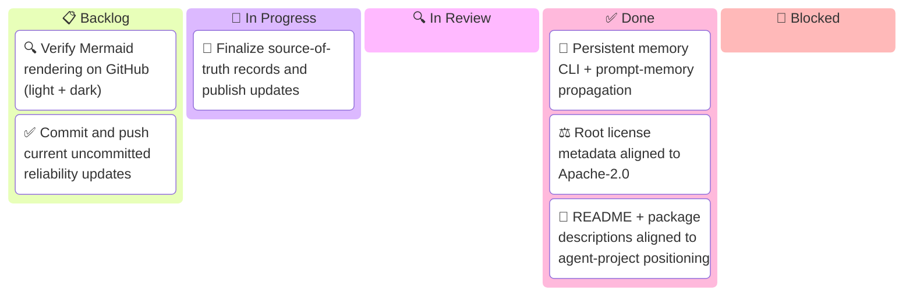
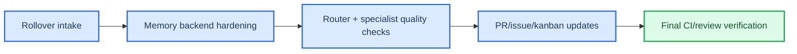
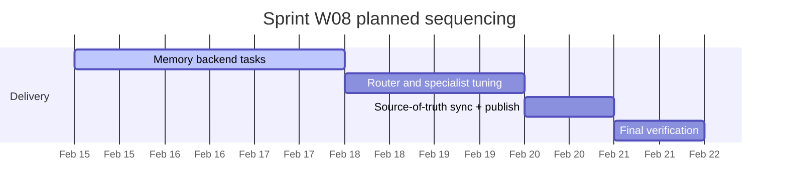

# Sprint W08 2026 — Kanban Board

_Sprint W08: Feb 15-21, 2026 · opencode repo_
_Human · Last updated: 2026-02-15 12:54_

---

## 📋 Board Overview

**Period:** 2026-02-15 → 2026-02-21
**Goal:** Complete memory backend hardening (local-first text + SQL seed path), finalize router quality behavior by review mode, finish project identity/README positioning for `agent-project`, and close remaining source-of-truth and verification tasks.
**WIP Limit:** 3 items In Progress

### Visual board

_Kanban board showing Sprint W08 rollover state from W07 plus today-completed items moved into the correct week:_

---

## 🚦 Board Status

| Column             | Count | WIP Limit | Status                          |
| ------------------ | ----- | --------- | ------------------------------- |
| 📋 **Backlog**     | 2     | —         | Rolled from W07                 |
| 🔄 **In Progress** | 1     | 3         | 🟢 Under limit                  |
| 🔍 **In Review**   | 0     | —         | —                               |
| ✅ **Done**        | 4     | —         | W08 closeout items accumulating |
| 🚫 **Blocked**     | 0     | —         | Clear                           |

---

## 🧭 Execution map

_Execution flow for W08 priorities, emphasizing memory hardening and tracking-record closure:_

_Expected sequencing for the week across active tracks:_

---

## 📋 Backlog

_Prioritized top-to-bottom. Top items are next to be pulled._

| #   | Item                                                    | Priority | Estimate | Assignee | Notes                                                                  |
| --- | ------------------------------------------------------- | -------- | -------- | -------- | ---------------------------------------------------------------------- |
| 1   | Verify Mermaid rendering on GitHub (light + dark)       | 🔴 High  | S        | Human    | Push branch, check architecture/requirement/C4/radar/treemap diagrams  |
| 2   | Commit and push current uncommitted reliability updates | 🔴 High  | S        | Human    | Include provider routing, fail-fast timeout, memory/router/doc updates |

---

## 🔄 In Progress

| Item                                                 | Assignee   | Started | Expected | Days in column | Aging | Status                                                                            |
| ---------------------------------------------------- | ---------- | ------- | -------- | -------------- | ----- | --------------------------------------------------------------------------------- |
| Finalize source-of-truth records and publish updates | Human + AI | Feb 14  | Feb 15   | 1              | 🟡    | 🟡 Complete-full local CI and post-sync link-check passed; branch publish pending |

> ⚠️ **WIP limit:** 1 / 3. Under limit.

> 💡 **Aging indicator:** 🟢 Under expected time · 🟡 At expected time · 🔴 Over expected time.

---

## 🔍 In Review

| Item                   | Author | Reviewer | PR  | Days in review | Aging | Status |
| ---------------------- | ------ | -------- | --- | -------------- | ----- | ------ |
| _(No items in review)_ |        |          |     |                |       |        |

---

## ✅ Done

_Completed in current week (including today items moved from prior board)._

| Item                                                                                                                                                | Assignee   | Completed | Cycle time | PR                                                                 |
| --------------------------------------------------------------------------------------------------------------------------------------------------- | ---------- | --------- | ---------- | ------------------------------------------------------------------ |
| Added persistent memory management CLI (`scripts/memory.sh`) and prompt memory propagation                                                          | Human + AI | Feb 15    | 1 day      | [#1](../pr/pr-00000001-agentic-docs-and-monorepo-modernization.md) |
| Corrected root package metadata license from MIT to Apache-2.0 to match repo policy                                                                 | Human + AI | Feb 15    | 1 day      | [#1](../pr/pr-00000001-agentic-docs-and-monorepo-modernization.md) |
| Local CI now always runs docs link checks (internal checker fallback) and writes markdown artifacts into `.crewai/workspace` for CrewAI consumption | Human + AI | Feb 15    | 1 day      | [#1](../pr/pr-00000001-agentic-docs-and-monorepo-modernization.md) |

---

## 🚫 Blocked

| Item                             | Assignee | Blocked since | Blocked by | Escalated to | Unblock action |
| -------------------------------- | -------- | ------------- | ---------- | ------------ | -------------- |
| _(No blocked items this sprint)_ |          |               |            |              |                |

---

## 📊 Metrics

### This period

| Metric                             | Value   | Target | Trend |
| ---------------------------------- | ------- | ------ | ----- |
| **Throughput** (items completed)   | 4       | 4      | →     |
| **Avg cycle time** (start → done)  | 1.0 day | —      | —     |
| **Avg lead time** (created → done) | 1.0 day | —      | —     |
| **Avg review time**                | —       | —      | —     |
| **Flow efficiency**                | ~70%    | 40%    | →     |
| **Blocked items**                  | 0       | 0      | →     |
| **WIP limit breaches**             | 0       | 0      | →     |
| **Items aging red**                | 0       | 0      | →     |

---

## 📝 Board Notes

### Decisions made this period

- **Feb 15:** New weekly board opened and W07 carryover applied.
- **Feb 15:** Week-boundary hygiene rule applied: Feb 15 completed items tracked in W08 Done.
- **Feb 15:** Continuation scope expanded to include root README and package-metadata positioning for `agent-project` template identity.
- **Feb 15:** README and package-metadata positioning task completed; final CI evidence capture is now the remaining active item.
- **Feb 15:** `./scripts/ci-local.sh --complete-full-review` passed after identity updates; only final source-of-truth closeout remains.
- **Feb 15:** Post-sync `./scripts/ci-local.sh --step link-check` rerun passed after record updates.

### Carryover from last period

- Verify Mermaid rendering on GitHub (light + dark).
- Commit and push current uncommitted reliability updates.
- Finalize source-of-truth records and publish updates.

### Upcoming dependencies

- Push branch and validate Mermaid rendering in GitHub UI.
- Complete pending mem0 self-hosted + compact-memory capability and update docs/records.

---

## 🔗 References

- [Previous board: Sprint W07](./sprint-2026-w07-agentic-template-modernization.md)
- [Issue-#2: Provider priority + fail-fast + local pricing visibility](../issues/issue-00000002-provider-priority-fail-fast-review-cost-visibility.md)
- [Issue-#3: Local review context pack and resilience](../issues/issue-00000003-local-review-context-pack-and-resilience.md)
- [Issue-#4: Memory backend self-hosted and SQL seed](../issues/issue-00000004-memory-backend-self-hosted-and-sql-seed.md)
- [PR-#1: Agentic documentation system + repo cleanup](../pr/pr-00000001-agentic-docs-and-monorepo-modernization.md)

---

_Next update: 2026-02-15 · Board owner: Human_
